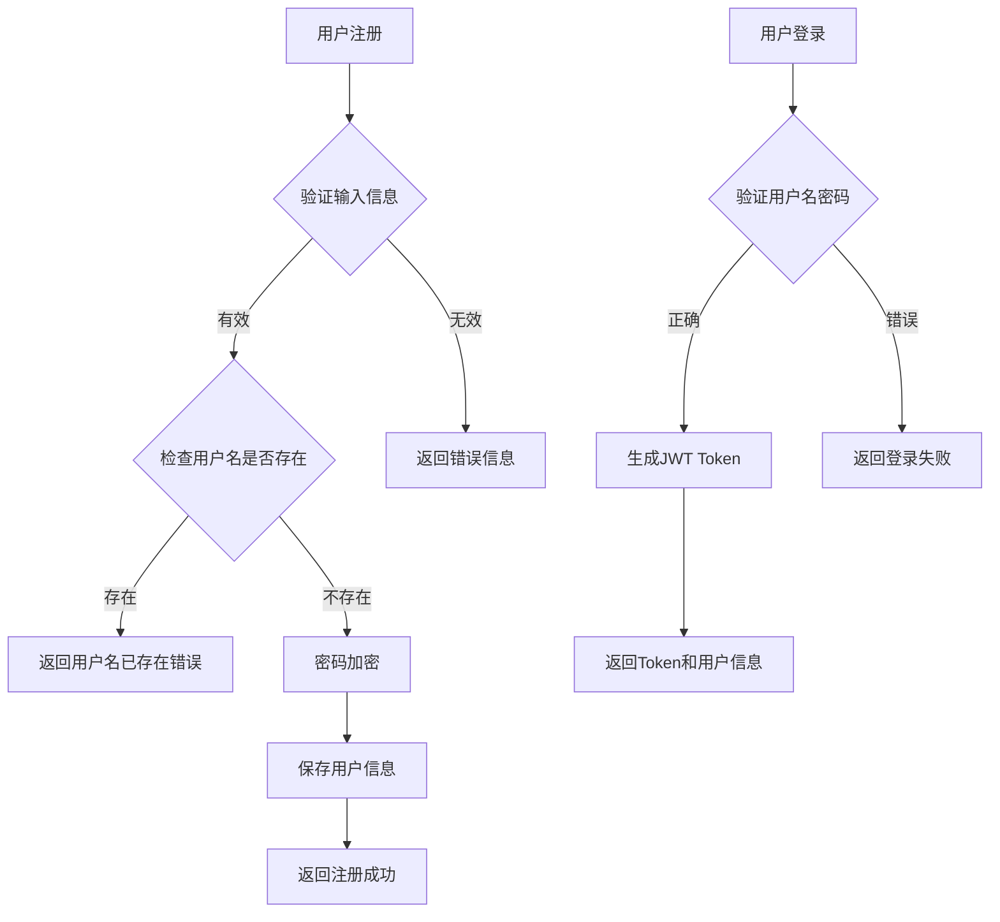
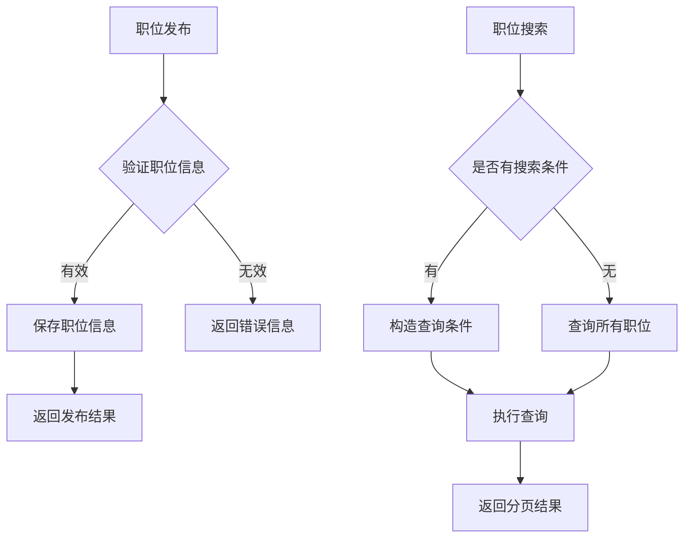
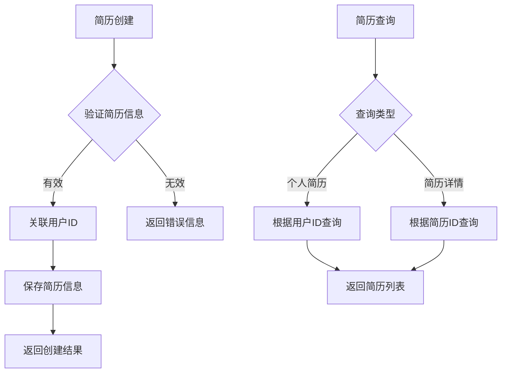
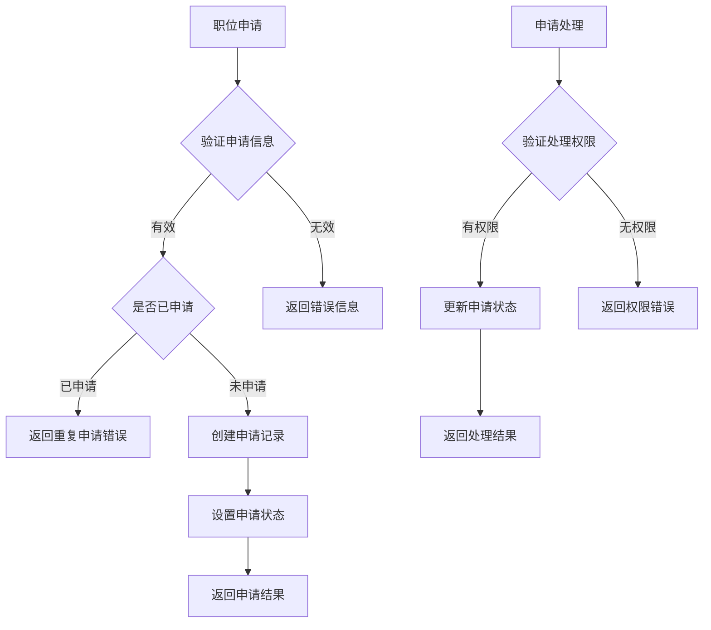
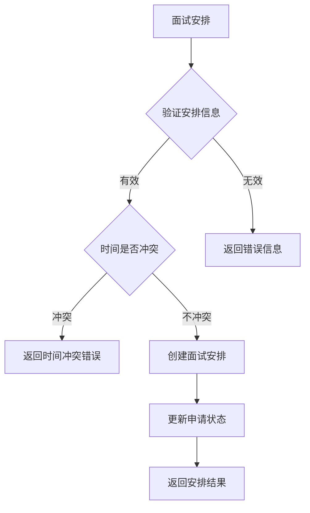
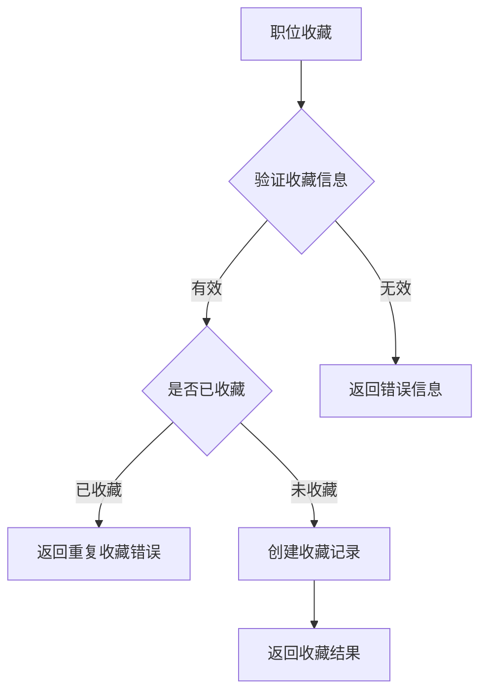
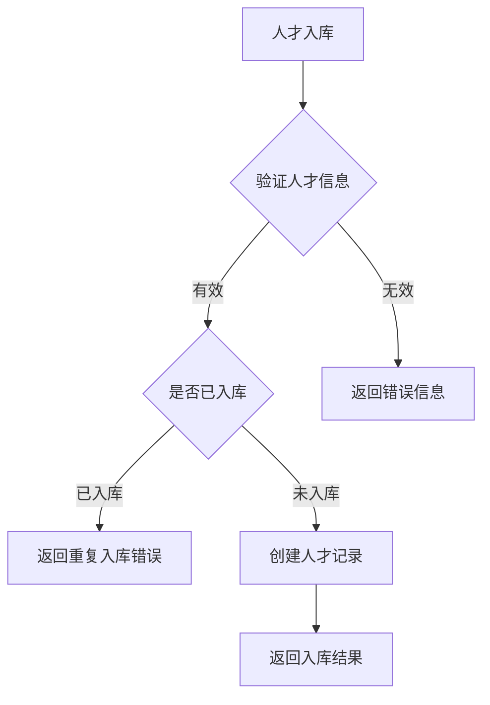

# 软件详细设计说明书

## 1 引言

### 1.1 编写目的

本文档旨在详细描述ATS（Applicant Tracking System）招聘管理系统的各个模块的具体实现细节，为开发人员编码和测试人员制定测试用例提供依据。该文档面向系统开发人员、测试人员和维护人员。

### 1.2 背景

ATS招聘管理系统是一个基于Web的企业级招聘管理平台，旨在帮助企业提高招聘效率，降低人力资源成本。系统采用前后端分离的架构模式，后端基于Spring Boot框架开发，前端使用HTML、CSS、JavaScript等技术实现。

### 1.3 定义

- **ATS**: Applicant Tracking System，招聘管理系统
- **JWT**: JSON Web Token，一种开放标准(RFC 7519)，用于在各方之间安全地传输信息
- **RESTful API**: 一种基于HTTP协议的API设计风格
- **MyBatis-Plus**: MyBatis的增强工具，简化了持久层开发
- **Spring Boot**: 一个基于Spring框架的快速开发脚手架
- **MVC**: Model-View-Controller，模型-视图-控制器架构模式

### 1.4 参考资料

1. GB/T 8567-2006 计算机软件文档编制规范
2. 《软件需求规格说明书》
3. 《软件概要设计说明书》
4. Spring Boot官方文档
5. MyBatis-Plus官方文档
6. MySQL官方文档

## 2 程序描述

### 2.1 用户管理模块

#### 2.1.1 模块描述

用户管理模块负责系统的用户注册、登录、信息管理等功能。包括求职者、HR、企业管理者和系统管理员等不同类型用户。

#### 2.1.2 功能

1. 用户注册
2. 用户登录
3. 用户信息管理
4. HR账户管理

#### 2.1.3 性能

1. 用户登录响应时间不超过1秒
2. 用户信息查询响应时间不超过0.5秒

#### 2.1.4 输入项

1. 用户注册信息（用户名、密码、邮箱、手机号）
2. 用户登录信息（用户名、密码）
3. 用户更新信息（邮箱、手机号等）

#### 2.1.5 输出项

1. 注册结果
2. 登录结果和JWT Token
3. 用户信息

#### 2.1.6 算法

1. 密码加密算法：使用BCryptPasswordEncoder进行密码加密
2. JWT生成算法：使用HS256算法生成Token

#### 2.1.7 流程逻辑

#### 2.1.8 接口

UserController提供以下RESTful API接口：
- POST /api/user/register - 用户注册
- POST /api/user/login - 用户登录
- GET /api/user/{userId} - 获取用户信息
- PUT /api/user/{userId} - 更新用户信息

#### 2.1.9 存储分配

用户信息存储在sys_user表中，字段包括：
- user_id: 用户ID
- username: 用户名
- password: 密码（加密存储）
- phone: 手机号
- email: 邮箱
- user_type: 用户类型
- status: 账户状态
- create_time: 创建时间
- update_time: 更新时间
- delete_flag: 删除标记
- company_id: 所属企业ID

#### 2.1.10 注释设计

代码中使用标准JavaDoc注释，详细说明每个类和方法的作用、参数和返回值。

#### 2.1.11 限制条件

1. 用户名必须唯一
2. 密码长度不少于6位
3. 邮箱格式需要验证

#### 2.1.12 测试要点

1. 测试用户名重复注册的情况
2. 测试密码强度验证
3. 测试登录成功和失败的各种情况
4. 测试Token的有效性

### 2.2 职位管理模块

#### 2.2.1 模块描述

职位管理模块负责职位信息的发布、维护、搜索等功能。HR可以通过该模块管理企业的职位信息。

#### 2.2.2 功能

1. 职位发布
2. 职位信息维护
3. 职位状态管理
4. 职位搜索与浏览

#### 2.2.3 性能

1. 职位列表查询响应时间不超过1秒
2. 职位详情查询响应时间不超过0.5秒

#### 2.2.4 输入项

1. 职位基本信息（职位名称、部门、工作地点等）
2. 职位要求（学历、工作经验等）
3. 搜索条件（关键词、筛选条件等）

#### 2.2.5 输出项

1. 职位发布结果
2. 职位列表（分页）
3. 职位详情

#### 2.2.6 算法

1. 分页查询算法：使用MyBatis-Plus的分页插件
2. 搜索过滤算法：根据搜索条件动态构造查询条件

#### 2.2.7 流程逻辑

#### 2.2.8 接口

JobInfoController提供以下RESTful API接口：
- POST /api/job/info - 创建职位
- PUT /api/job/info - 更新职位
- DELETE /api/job/info/{id} - 删除职位
- GET /api/job/info/list - 获取职位列表
- GET /api/job/info/{id} - 获取职位详情

#### 2.2.9 存储分配

职位信息存储在job_info表中，字段包括：
- job_id: 职位ID
- company_id: 公司ID
- job_name: 职位名称
- department: 部门
- province: 省份
- city: 城市
- district: 区县
- salary_min: 最低薪资
- salary_max: 最高薪资
- education: 学历要求
- work_experience: 工作经验要求
- job_desc: 职位描述
- publisher_id: 发布人ID
- publish_status: 发布状态
- create_time: 创建时间
- update_time: 更新时间
- delete_flag: 删除标记

#### 2.2.10 注释设计

代码中使用标准JavaDoc注释，详细说明每个类和方法的作用、参数和返回值。

#### 2.2.11 限制条件

1. 职位名称不能为空
2. 薪资范围需要合理（最小值不大于最大值）
3. 只有HR可以发布职位

#### 2.2.12 测试要点

1. 测试职位信息验证逻辑
2. 测试分页查询功能
3. 测试职位搜索功能
4. 测试职位状态变更功能

### 2.3 简历管理模块

#### 2.3.1 模块描述

简历管理模块负责求职者简历的创建、编辑、删除等功能。求职者可以通过该模块管理自己的简历信息。

#### 2.3.2 功能

1. 简历创建
2. 简历编辑
3. 简历删除
4. 简历查询

#### 2.3.3 性能

1. 简历创建响应时间不超过1秒
2. 简历列表查询响应时间不超过0.5秒

#### 2.3.4 输入项

1. 简历基本信息（姓名、性别、年龄等）
2. 教育背景
3. 工作经验
4. 技能信息

#### 2.3.5 输出项

1. 简历创建结果
2. 简历列表
3. 简历详情

#### 2.3.6 算法

1. 简历关联算法：简历与用户ID关联
2. 逻辑删除算法：使用delete_flag字段标记删除

#### 2.3.7 流程逻辑

#### 2.3.8 接口

ResumeInfoController提供以下RESTful API接口：
- POST /api/resume - 创建简历
- PUT /api/resume - 更新简历
- DELETE /api/resume/{resumeId} - 删除简历
- GET /api/resume/{resumeId} - 获取简历详情
- GET /api/resume/user/{userId} - 获取用户的所有简历

#### 2.3.9 存储分配

简历信息存储在resume_info表中，字段包括：
- resume_id: 简历ID
- user_id: 用户ID
- resume_name: 简历名称
- name: 姓名
- gender: 性别
- age: 年龄
- education: 学历
- work_experience: 工作经验
- skill: 技能
- job_intention: 求职意向
- phone: 联系电话
- email: 邮箱
- create_time: 创建时间
- update_time: 更新时间
- delete_flag: 删除标记

#### 2.3.10 注释设计

代码中使用标准JavaDoc注释，详细说明每个类和方法的作用、参数和返回值。

#### 2.3.11 限制条件

1. 简历名称不能为空
2. 每个用户只能查看和管理自己的简历

#### 2.3.12 测试要点

1. 测试简历信息验证逻辑
2. 测试简历权限控制
3. 测试简历逻辑删除功能
4. 测试简历查询功能

### 2.4 职位申请管理模块

#### 2.4.1 模块描述

职位申请管理模块负责求职者职位申请和HR申请处理等功能。求职者可以申请职位，HR可以查看和处理申请。

#### 2.4.2 功能

1. 职位申请
2. 申请状态跟踪
3. 申请管理

#### 2.4.3 性能

1. 职位申请响应时间不超过1秒
2. 申请列表查询响应时间不超过1秒

#### 2.4.4 输入项

1. 申请信息（职位ID、简历ID）
2. 状态更新信息

#### 2.4.5 输出项

1. 申请结果
2. 申请列表
3. 申请详情

#### 2.4.6 算法

1. 申请去重算法：同一用户不能重复申请同一职位
2. 状态流转算法：申请状态按照预定义流程流转

#### 2.4.7 流程逻辑

#### 2.4.8 接口

JobApplicationController提供以下RESTful API接口：
- POST /api/applications - 申请职位
- GET /api/applications/my - 获取我的申请记录
- GET /api/applications/company/{companyId} - 获取公司下所有申请记录
- PUT /api/applications/{applicationId}/status - 更新申请状态
- PUT /api/applications/{applicationId}/withdraw - 取消申请

#### 2.4.9 存储分配

职位申请信息存储在job_application表中，字段包括：
- application_id: 申请ID
- job_id: 职位ID
- user_id: 用户ID
- resume_id: 简历ID
- status: 申请状态
- apply_time: 申请时间
- reason: 操作原因
- create_time: 创建时间
- update_time: 更新时间
- delete_flag: 删除标记

#### 2.4.10 注释设计

代码中使用标准JavaDoc注释，详细说明每个类和方法的作用、参数和返回值。

#### 2.4.11 限制条件

1. 同一用户不能重复申请同一职位
2. 只有相关HR可以处理申请

#### 2.4.12 测试要点

1. 测试申请去重逻辑
2. 测试申请状态流转
3. 测试权限控制
4. 测试申请查询功能

### 2.5 面试管理模块

#### 2.5.1 模块描述

面试管理模块负责面试安排和面试状态管理等功能。HR可以为通过初筛的申请人安排面试。

#### 2.5.2 功能

1. 面试安排
2. 面试状态管理

#### 2.5.3 性能

1. 面试安排响应时间不超过1秒
2. 面试列表查询响应时间不超过1秒

#### 2.5.4 输入项

1. 面试安排信息（申请ID、面试官ID、面试时间、面试地点）
2. 面试结果信息

#### 2.5.5 输出项

1. 安排结果
2. 面试列表
3. 面试详情

#### 2.5.6 算法

1. 时间冲突检测算法：检测面试官在同一时间是否有其他面试安排
2. 状态更新算法：根据面试结果更新申请状态

#### 2.5.7 流程逻辑

#### 2.5.8 接口

InterviewInfoController提供以下RESTful API接口：
- POST /api/interview - 创建面试安排
- PUT /api/interview - 更新面试安排
- DELETE /api/interview/{arrangeId} - 删除面试安排
- GET /api/interview/interviewer/{interviewerId} - 根据面试官ID获取面试信息
- GET /api/interview/user/{userId} - 根据求职者用户ID获取面试信息

#### 2.5.9 存储分配

面试信息存储在interview_info表中，字段包括：
- arrange_id: 安排ID
- application_id: 申请ID
- interviewer_id: 面试官ID
- interviewee_id: 面试者ID
- interview_time: 面试时间
- interview_place: 面试地点
- status: 面试状态
- create_time: 创建时间
- update_time: 更新时间
- delete_flag: 删除标记

#### 2.5.10 注释设计

代码中使用标准JavaDoc注释，详细说明每个类和方法的作用、参数和返回值。

#### 2.5.11 限制条件

1. 面试时间不能与面试官其他面试时间冲突
2. 只有相关HR可以安排面试

#### 2.5.12 测试要点

1. 测试时间冲突检测逻辑
2. 测试面试状态更新
3. 测试权限控制
4. 测试面试查询功能

### 2.6 职位收藏模块

#### 2.6.1 模块描述

职位收藏模块负责职位收藏和收藏管理等功能。求职者可以收藏感兴趣的职位。

#### 2.6.2 功能

1. 职位收藏
2. 收藏管理

#### 2.6.3 性能

1. 职位收藏响应时间不超过0.5秒
2. 收藏列表查询响应时间不超过1秒

#### 2.6.4 输入项

1. 收藏信息（用户ID、职位ID）

#### 2.6.5 输出项

1. 收藏结果
2. 收藏列表

#### 2.6.6 算法

1. 收藏去重算法：同一用户不能重复收藏同一职位
2. 收藏查询算法：根据用户ID查询收藏列表

#### 2.6.7 流程逻辑

#### 2.6.8 接口

JobFavoriteController提供以下RESTful API接口：
- POST /api/favorites - 收藏职位
- DELETE /api/favorites - 取消收藏
- GET /api/favorites/check - 检查是否已收藏
- GET /api/favorites/my - 分页查询我的收藏职位

#### 2.6.9 存储分配

职位收藏信息存储在job_favorite表中，字段包括：
- favorite_id: 收藏ID
- user_id: 用户ID
- job_id: 职位ID
- create_time: 创建时间
- delete_flag: 删除标记

#### 2.6.10 注释设计

代码中使用标准JavaDoc注释，详细说明每个类和方法的作用、参数和返回值。

#### 2.6.11 限制条件

1. 同一用户不能重复收藏同一职位
2. 只能管理自己的收藏

#### 2.6.12 测试要点

1. 测试收藏去重逻辑
2. 测试权限控制
3. 测试收藏查询功能

### 2.7 人才库管理模块

#### 2.7.1 模块描述

人才库管理模块负责优秀候选人入库和人才管理等功能。HR可以将优秀的候选人加入人才库。

#### 2.7.2 功能

1. 人才入库
2. 人才管理

#### 2.7.3 性能

1. 人才入库响应时间不超过1秒
2. 人才列表查询响应时间不超过1秒

#### 2.7.4 输入项

1. 人才信息（简历ID、公司ID、标签）

#### 2.7.5 输出项

1. 入库结果
2. 人才列表

#### 2.7.6 算法

1. 人才去重算法：同一公司不能重复收录同一简历
2. 人才查询算法：根据公司ID查询人才列表

#### 2.7.7 流程逻辑

#### 2.7.8 接口

TalentPoolController提供以下RESTful API接口：
- POST /api/talent - 新增人才
- PUT /api/talent - 修改人才
- DELETE /api/talent/{talentId} - 删除人才
- GET /api/talent/{talentId} - 根据ID查询人才
- GET /api/talent/company/{companyId} - 根据公司ID查询人才列表

#### 2.7.9 存储分配

人才信息存储在talent_pool表中，字段包括：
- talent_id: 人才ID
- resume_id: 简历ID
- company_id: 公司ID
- tag: 标签
- operator_id: 操作人ID
- put_in_time: 入库时间
- update_time: 更新时间
- delete_flag: 删除标记

#### 2.7.10 注释设计

代码中使用标准JavaDoc注释，详细说明每个类和方法的作用、参数和返回值。

#### 2.7.11 限制条件

1. 同一公司不能重复收录同一简历
2. 只有相关HR可以管理人才库

#### 2.7.12 测试要点

1. 测试人才去重逻辑
2. 测试权限控制
3. 测试人才查询功能

## 3 运行设计

### 3.1 运行关系

各模块之间的运行关系如下：

1. 用户管理模块为基础模块，为其他模块提供用户认证和权限控制
2. 职位管理模块和简历管理模块相对独立，为职位申请模块提供数据支持
3. 职位申请模块为核心业务模块，连接求职者和HR
4. 面试管理模块、职位收藏模块和人才库管理模块为职位申请模块的延伸

### 3.2 运行控制

系统运行控制通过Spring Security框架实现：
1. 用户认证：通过JWT Token验证用户身份
2. 权限控制：根据用户角色控制访问权限
3. 请求过滤：过滤非法请求

## 4 系统出错处理设计

### 4.1 出错输出信息

系统定义了统一的错误码和错误信息：

1. USERNAME_EXISTS(1001, "用户名已存在")
2. PHONE_EXISTS(1002, "手机号已存在")
3. EMAIL_EXISTS(1003, "邮箱已存在")
4. USER_NOT_FOUND(1004, "用户不存在")
5. PASSWORD_ERROR(1005, "密码错误")
6. ACCOUNT_DISABLED(1006, "账户已被禁用")
7. PARAM_INVALID(1007, "参数无效")
8. SYSTEM_ERROR(9999, "系统错误")

### 4.2 出错处理对策

1. **输入验证**：对所有用户输入进行严格验证
2. **异常捕获**：通过全局异常处理器捕获系统异常
3. **日志记录**：详细记录错误日志，便于问题追踪
4. **事务回滚**：对于数据库操作，使用事务确保数据一致性
5. **友好提示**：向用户提供清晰的错误提示信息

## 5 可维护性设计

### 5.1 模块化设计

系统采用模块化设计，各功能模块相对独立，便于维护和扩展。

### 5.2 日志记录

系统使用Slf4j日志框架记录操作日志和错误日志，便于问题排查。

### 5.3 异常处理

系统实现了全局异常处理机制，能够捕获并处理各种异常情况。

### 5.4 配置管理

系统的关键配置通过配置文件进行管理，便于调整和维护。

## 6 系统数据结构设计要点

### 6.1 数据库表设计

所有表均采用以下设计原则：
1. 主键均采用bigint类型自增ID
2. 所有表均包含create_time和update_time字段
3. 使用delete_flag字段实现逻辑删除
4. 合理建立索引以提高查询性能

### 6.2 数据一致性

1. 使用数据库事务保证数据一致性
2. 使用外键约束（应用层实现）维护数据完整性
3. 使用唯一索引避免重复数据

## 7 系统安全设计

### 7.1 身份认证

1. 使用JWT Token实现无状态认证
2. 密码使用BCryptPasswordEncoder加密存储
3. Token设置合理的过期时间

### 7.2 权限控制

1. 基于角色的访问控制（RBAC）
2. 接口级别的权限验证
3. 数据级别的权限控制

### 7.3 数据安全

1. 敏感信息加密存储
2. 防止SQL注入攻击
3. 防止XSS攻击